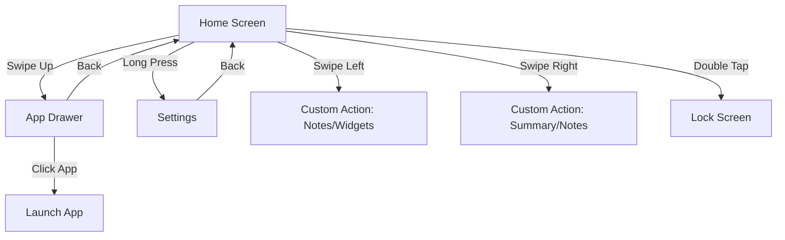

# VOID Launcher

VOID Launcher is a high-performance, minimalist Android launcher built from the ground up using **Jetpack Compose** and **Material 3**. It is designed to reduce digital clutter while providing advanced modern features like on-device AI summarization and deep Android 15 integration.

---

## 📱 Screen Flow & Navigation

The application follows a intuitive gesture-based mental model for navigation:



- **Home Screen**: Your minimalist workspace. It displays the clock, date, and your pinned favorite apps.
- **App Drawer**: A searchable list of all installed applications. Features instant keyboard launch for power users.
- **Settings**: Comprehensive customization including theme modes, font selection, and gesture mapping.
- **Utility Screens**: Configurable screens for **Notes**, **Widgets**, and **AI Notification Summary**.

---

## 🛠 Project Structure

The project follows a clean, modular architecture organized by functional layer:

- **`com.knownassurajit.app.launcher.voidlauncher`**
    - `MainActivity.kt`: The single-activity entry point hosting the Compose NavHost.
    - `AppRoutes.kt`: Type-safe navigation routes using Kotlin Serialization.
    - `MainViewModel.kt` / `MainUiViewModel.kt`: Hoisting UI state and business logic.
- **`ui/`**
    - `screen/`: Implementation of all Jetpack Compose screens.
    - `theme/`: Material 3 design system tokens (Color, Type, Theme).
- **`data/`**
    - Repositories and models for Notes, Apps, and Preferences.
- **`helper/`**
    - `AiSummarizer.kt`: Integration with ML Kit GenAI for on-device summaries.
    - `NotificationService.kt`: Background listener for processing incoming notifications.
    - `AppCacheManager.kt`: Efficient caching of app metadata and icons.
- **`listener/`**
    - Hardware and OS listeners for device administration and profile changes.

---

## 📖 User Manual

### Gestures & Interaction
- **Launch Apps**: Tap an app name on the home screen or search in the app drawer.
- **Access Settings**: Long-press any empty area on the Home Screen.
- **Quick Lock**: Double-tap on the Home Screen (requires Accessibility Service or Device Admin permission).
- **Setup Gestures**: Go to `Settings > Gestures` to map left and right swipes to your preferred tools (Notes, Widgets, or AI Summary).

### AI Notification Summary
VOID uses Gemini Nano (via ML Kit) to summarize your notifications locally on your device. 
- Enable the feature in Settings.
- Swipe to the Notification Summary screen to see a distilled view of your recent alerts.
- *Note: Requires a device with AICore support (e.g., Pixel 8+, Galaxy S24+).*

### Private Space (Android 15+)
- VOID automatically detects and isolates Private Space profiles.
- Hidden apps appear in a dedicated section at the bottom of the App Drawer.
- Profile locking/unlocking is synchronized with system biometric states.

---

## 🚀 Build & Development

### Prerequisite Environment
- **JDK 21** (Required for current build toolchain)
- **Android SDK 35**
- **Gradle 8.7+**

### Standard Commands
```bash
# Clean and Build Debug APK
./gradlew clean :app:assembleDebug

# Run Unit Tests
./gradlew :app:testDebugUnitTest

# Run Lint Analysis
./gradlew lintDebug
```

---

## ⚖️ License & Credits

- **License**: GPL-3.0
- **Typography**: Inter (RSMS), Google Sans.
- **Icons**: Material Symbols (Google).

---

*“Are you using your phone, or is your phone using you?”* — VOID Launcher
