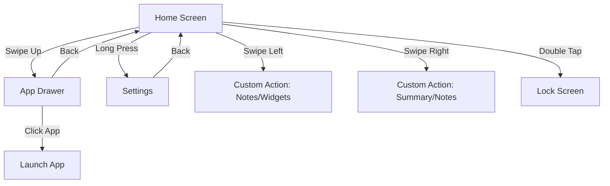

<<<<<<< HEAD
# VOID Launcher

VOID Launcher is a high-performance, minimalist Android launcher built from the ground up using **Jetpack Compose** and **Material 3**. It is designed to reduce digital clutter while providing advanced modern features like on-device AI summarization and deep Android 15 integration.

---

## 📱 Screen Flow & Navigation

The application follows a intuitive gesture-based mental model for navigation:



- **Home Screen**: Your minimalist workspace. It displays the clock, date, and your pinned favorite apps.
- **App Drawer**: A searchable list of all installed applications. Features instant keyboard launch for power users.
- **Settings**: Comprehensive customization including theme modes, font selection, and gesture mapping.
- **Utility Screens**: Configurable screens for **Notes**, **Widgets**, and **AI Notification Summary**.

---

## 🛠 Project Structure

The project follows a clean, modular architecture organized by functional layer:

- **`com.knownassurajit.app.launcher.voidlauncher`**
    - `MainActivity.kt`: The single-activity entry point hosting the Compose NavHost.
    - `AppRoutes.kt`: Type-safe navigation routes using Kotlin Serialization.
    - `MainViewModel.kt` / `MainUiViewModel.kt`: Hoisting UI state and business logic.
- **`ui/`**
    - `screen/`: Implementation of all Jetpack Compose screens.
    - `theme/`: Material 3 design system tokens (Color, Type, Theme).
- **`data/`**
    - Repositories and models for Notes, Apps, and Preferences.
- **`helper/`**
    - `AiSummarizer.kt`: Integration with ML Kit GenAI for on-device summaries.
    - `NotificationService.kt`: Background listener for processing incoming notifications.
    - `AppCacheManager.kt`: Efficient caching of app metadata and icons.
- **`listener/`**
    - Hardware and OS listeners for device administration and profile changes.

---

## 📖 User Manual

### Gestures & Interaction
- **Launch Apps**: Tap an app name on the home screen or search in the app drawer.
- **Access Settings**: Long-press any empty area on the Home Screen.
- **Quick Lock**: Double-tap on the Home Screen (requires Accessibility Service or Device Admin permission).
- **Setup Gestures**: Go to `Settings > Gestures` to map left and right swipes to your preferred tools (Notes, Widgets, or AI Summary).

### AI Notification Summary
VOID uses Gemini Nano (via ML Kit) to summarize your notifications locally on your device. 
- Enable the feature in Settings.
- Swipe to the Notification Summary screen to see a distilled view of your recent alerts.
- *Note: Requires a device with AICore support (e.g., Pixel 8+, Galaxy S24+).*

### Private Space (Android 15+)
- VOID automatically detects and isolates Private Space profiles.
- Hidden apps appear in a dedicated section at the bottom of the App Drawer.
- Profile locking/unlocking is synchronized with system biometric states.

---

## 🚀 Build & Development

### Prerequisite Environment
- **JDK 21** (Required for current build toolchain)
- **Android SDK 35**
- **Gradle 8.7+**

### Standard Commands
```bash
# Clean and Build Debug APK
./gradlew clean :app:assembleDebug

# Run Unit Tests
./gradlew :app:testDebugUnitTest

# Run Lint Analysis
./gradlew lintDebug
```

---

## ⚖️ License & Credits

- **License**: GPL-3.0
- **Typography**: Inter (RSMS), Google Sans.
- **Icons**: Material Symbols (Google).

---

*“Are you using your phone, or is your phone using you?”* — VOID Launcher
=======
# 🚀 VOID Launcher (formerly Olauncher)

**VOID Launcher** is a radically minimalist, ad-free (AF) Android launcher designed to combat digital addiction and promote digital well-being. It eschews colorful icons and grids in favor of a clean, text-based interface that minimizes distractions and helps you use your phone purposefully. 

## 📖 Table of Contents
- [📱 Screenshots & Design](#-screenshots--design)
- [✨ Key Features](#-key-features)
- [🏗 Project Structure & Architecture](#-project-structure--architecture)
- [🛣 Screen Flow & Navigation](#-screen-flow--navigation)
- [🛠 Tech Stack & Dependencies](#-tech-stack--dependencies)
- [⚙️ Building the Source](#️-building-the-source)
- [📄 License & Credits](#-license--credits)

---

## 📱 Screenshots & Design

VOID Launcher features an ultra-clean, text-based minimalist design.

<div align="center">
  
  
  
  
</div>

---

## ✨ Key Features

Despite its minimal footprint (< 2MB), VOID Launcher is highly functional. To maintain simplicity, most features are accessed via gestures and long-presses:

- **Text-based Home Screen**: Clean, text-only shortcuts to up to 8 of your most essential apps.
- **Fast App Drawer**: Swipe up to instantly access all apps.
- **Auto-keyboard Search**: Optionally deploy the keyboard automatically upon opening the drawer for immediate search queries.
- **Quick Swipe Gestures**: Swipe left or right on the home screen to instantly launch designated apps (e.g., Camera, Phone).
- **Double Tap to Lock**: Easily lock your device simply by double-tapping empty space (Requires Accessibility or Device Admin permissions).
- **Hidden Apps**: Keep your app drawer clutter-free by long-pressing an app to hide it.
- **Visual Customizations**:
  - App list alignment (Left, Center, Right).
  - Hide/Show system Status Bar.
  - Hide/Show Date/Time.
  - Light, Dark, or System default theme syncing.
- **Daily Wallpapers**: Fresh, high-quality minimalistic wallpapers fetched and updated daily.

---

## 🏗 Project Structure & Architecture

VOID Launcher uses Android's modern native development tools and architectures:

- `app/src/main/java/com/voidlauncher/app/`
  - `ui/`: Contains heavily cohesive view components like `HomeFragment`, `AppListFragment`, and `SettingsFragment`.
  - `helper/`: Utility functions spanning bitmap handling, intent wrappers, display metrics, and Kotlin extension functions (`Extensions.kt`, `Utils.kt`).
  - `data/`: Core constants and SharedPreferences delegates (`Prefs.kt`) handling the user's customized text-alignments, app limits, and states.
  - `worker/`: `WallpaperWorker.kt` implements Android `WorkManager` for fetching daily abstract wallpapers smoothly in the background without draining the battery.
  - `listener/`: Touch layer controllers translating raw coordinates into semantic gestures (e.g., `ViewSwipeTouchListener`).

---

## 🛣 Screen Flow & Navigation

The Application operates through a Single Activity Architecture (`MainActivity.kt`) orchestrated via Android's Jetpack Navigation Component.

1. **Home Screen (`HomeFragment`)**: The default entry point. Rendered dynamically. Shows date/time and up to 8 pinned apps. Listens to swipe gestures.
2. **App Drawer (`AppListFragment`)**: Invoked by swiping up on the Home screen. Contains a fast scrollable list of all installed packages utilizing a performant `RecyclerView`.
3. **Settings Panel (`SettingsFragment`)**: Invoked by a long-press on the Home Screen. Provides a scrolling toggle interface for adjusting Text Size, Accessibility permissions, daily wallpapers, and more.

---

## 🛠 Tech Stack & Dependencies

- **Language:** Kotlin
- **Minimum SDK:** 26 (Android 8.0) | **Target SDK:** 35
- **UI Toolkit:** Android ViewBinding, XML Layouts, Google Material Design Components.
- **Architecture Components:**
  - ViewModels & LiveData
  - Navigation Graph (`res/navigation/nav_graph.xml`)
  - WorkManager
- **Build System:** Gradle (Kotlin DSL ready) utilizing Version Catalogs (`libs.versions.toml`).

---

## ⚙️ Building the Source

1. Clone the repository.
2. Ensure you have the Android SDK (API 35) installed.
3. Because the package was renamed to `com.voidlauncher.app`, ensure there are no remnants of the old `app.olauncher` package.
4. Run the Gradle wrapper:
   ```bash
   ./gradlew clean build assembleDebug
   ```

---

## 📄 License & Credits

License: [GNU GPLv3](https://www.gnu.org/licenses/gpl-3.0.en.html)

App renamed and restructured from the original open-source base "Olauncher".
Dev for original base: [X/twitter](https://x.com/tanujnotes) • [Bluesky](https://bsky.app/profile/tanujnotes.bsky.social)
>>>>>>> d08f02b (Revert "develop <- stage (#9)")
