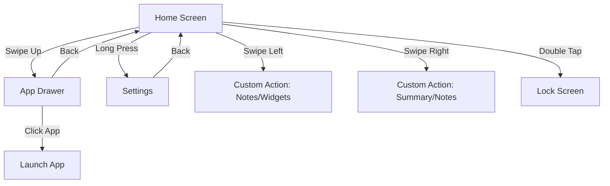

<<<<<<< HEAD
<<<<<<< HEAD
# VOID Launcher

VOID Launcher is a high-performance, minimalist Android launcher built from the ground up using **Jetpack Compose** and **Material 3**. It is designed to reduce digital clutter while providing advanced modern features like on-device AI summarization and deep Android 15 integration.

---

## 📱 Screen Flow & Navigation

The application follows a intuitive gesture-based mental model for navigation:



- **Home Screen**: Your minimalist workspace. It displays the clock, date, and your pinned favorite apps.
- **App Drawer**: A searchable list of all installed applications. Features instant keyboard launch for power users.
- **Settings**: Comprehensive customization including theme modes, font selection, and gesture mapping.
- **Utility Screens**: Configurable screens for **Notes**, **Widgets**, and **AI Notification Summary**.

---

## 🛠 Project Structure

The project follows a clean, modular architecture organized by functional layer:

- **`com.knownassurajit.app.launcher.voidlauncher`**
    - `MainActivity.kt`: The single-activity entry point hosting the Compose NavHost.
    - `AppRoutes.kt`: Type-safe navigation routes using Kotlin Serialization.
    - `MainViewModel.kt` / `MainUiViewModel.kt`: Hoisting UI state and business logic.
- **`ui/`**
    - `screen/`: Implementation of all Jetpack Compose screens.
    - `theme/`: Material 3 design system tokens (Color, Type, Theme).
- **`data/`**
    - Repositories and models for Notes, Apps, and Preferences.
- **`helper/`**
    - `AiSummarizer.kt`: Integration with ML Kit GenAI for on-device summaries.
    - `NotificationService.kt`: Background listener for processing incoming notifications.
    - `AppCacheManager.kt`: Efficient caching of app metadata and icons.
- **`listener/`**
    - Hardware and OS listeners for device administration and profile changes.

---

## 📖 User Manual

### Gestures & Interaction
- **Launch Apps**: Tap an app name on the home screen or search in the app drawer.
- **Access Settings**: Long-press any empty area on the Home Screen.
- **Quick Lock**: Double-tap on the Home Screen (requires Accessibility Service or Device Admin permission).
- **Setup Gestures**: Go to `Settings > Gestures` to map left and right swipes to your preferred tools (Notes, Widgets, or AI Summary).

### AI Notification Summary
VOID uses Gemini Nano (via ML Kit) to summarize your notifications locally on your device. 
- Enable the feature in Settings.
- Swipe to the Notification Summary screen to see a distilled view of your recent alerts.
- *Note: Requires a device with AICore support (e.g., Pixel 8+, Galaxy S24+).*

### Private Space (Android 15+)
- VOID automatically detects and isolates Private Space profiles.
- Hidden apps appear in a dedicated section at the bottom of the App Drawer.
- Profile locking/unlocking is synchronized with system biometric states.

---

## 🚀 Build & Development

### Prerequisite Environment
- **JDK 21** (Required for current build toolchain)
- **Android SDK 35**
- **Gradle 8.7+**

### Standard Commands
```bash
# Clean and Build Debug APK
./gradlew clean :app:assembleDebug

# Run Unit Tests
./gradlew :app:testDebugUnitTest

# Run Lint Analysis
./gradlew lintDebug
```

---

## ⚖️ License & Credits

- **License**: GPL-3.0
- **Typography**: Inter (RSMS), Google Sans.
- **Icons**: Material Symbols (Google).

---

*“Are you using your phone, or is your phone using you?”* — VOID Launcher
=======
# 🚀 VOID Launcher (formerly Olauncher)
=======
<p align="center">
  
</p>
>>>>>>> 7c83749 (rebasing develop from stage (#44))

<h1 align="center">VOID Launcher</h1>

<p align="center">
  <em>A radically minimalist, ad-free Android launcher designed to combat digital addiction.</em>
</p>

<p align="center">
  
  
  
  
  
  
</p>

---

## Philosophy

**VOID** is not just a launcher; it's a tool for digital minimalism. By stripping away colorful icons, badges, and the traditional grid layout, VOID forces intentionality. We present a hyper-clean, text-based interface where your focus dictates your actions, not the other way around. No ads, no tracking, no distractions.

---

## Core Features

- **Text-Only Home Screen:** Up to 10 of your most important apps are pinned to the home screen as clean, customizable text labels. They sit beautifully upon minimalist, un-filled, white-underlined cards elegantly padding the bottom of the screen.
- **Notification Grouping:** Swipe left to access a purpose-built notification screen that groups system notifications by app with smart summaries, timestamps, app-badge counts, and inline expansion — styled in the launcher's monochrome theme. Click any preview to jump directly into the conversation.
- **Quick Notes:** Swipe right to instantly capture thoughts in a monochrome, text-based checklist — native to the launcher with priority ordering, tick-to-complete, swipe-to-delete, and a per-note options menu with inline reminder countdowns.
- **Reverse Navigation Gestures:** Once inside the Notes or Notifications screen, executing a reverse swipe intuitively pulls you right back to your Home screen, mirroring the natural entry swipe.
- **Hold to Edit & Reorder:** Long-press a home screen app card to trigger Inline Edit Mode. The app label dynamically shrinks to reveal an inline pen (reassign) and reorder (drag) icon instantly without jumping to a new screen.
- **Directional Animations:** Every gesture transition slides in gracefully from the opposite direction to the swipe: e.g., swiping left pulls the Notifications screen in from the right.
- **Robust App Launcher:** Advanced component resolution ensures that even when applications update their internal packages or icon labels, VOID will dynamically re-resolve their launch intents.
- **Deep Private Space Integration:** Built for Android 15+. Access your hidden, secure, or work-profile apps directly from the main drawer with biometric unlock.
- **Digital Wellbeing Built-in:** See your actual screen time and unlock count overlaid on the home screen immediately.
- **Separate Text Size Controls:** Independent text size scaling for the home screen and app drawer.
- **Fluid Inline Settings UI:** Configure your launcher entirely within the app with smooth-animated inline cards.
- **Daily Wallpapers:** Automatically fetch and apply fresh, minimalist wallpapers (opt-in).

---

## Interaction & Gestures

```text
Home Screen
├── Swipe Up         → Opens App Drawer (auto-focuses search bar)
├── Swipe Down       → Expands Notification Panel / Web Search (configurable)
├── Swipe Left       → Notification Grouping Screen
├── Swipe Right      → Quick Notes Screen
├── Long Press       → Advanced Inline Settings Panel
├── Double Tap       → Sleep/Lock Screen
└── Hold + Drag      → Reorder home screen apps

App Drawer
├── Type to search   → Instantly filter apps or query the web
├── Type "private"   → Unlock biometric Private Space and reveal hidden apps
└── Long Press App   → Hide App / Open System App Info / Uninstall
```

---

## Technical Architecture

VOID Launcher embraces modern Android development practices, ensuring a tiny memory footprint while remaining highly performant.

- **Stack:** 100% Kotlin
- **UI:** XML Layouts, Material Design 3 guidelines (M3 typography, outlined cards, clean padding), and Android ViewBinding.
- **Architecture:** Single-Activity, Fragment-based navigation powered by a shared `MainViewModel` utilizing `LiveData` and Kotlin Coroutines.
- **Notification System:** A `NotificationListenerService` intercepts system-wide notifications and groups them intelligently by app and conversation.
- **Notes Storage:** Lightweight `SharedPreferences`-backed JSON persistence — no heavy database dependency for a launcher.
- **Background Processes:** Reliable `WorkManager` API to execute low-impact background fetches (e.g., daily wallpaper downloads).
- **Hardware Support:** Fully compatible with specialized hardware like E-Ink arrays.

---

## Building from Source

**Prerequisites:**
- Android Studio Koala (or newer)
- Android SDK API 35
- JDK 17+

```bash
# Clone the repository
git clone https://github.com/knownassurajit/void.git
cd void

# Build the debug APK
./gradlew clean assembleDebug
```

The output APK will be generated at `app/build/outputs/apk/debug/`.

---

## Acknowledgments & License

This project is licensed under the [GNU General Public License v3.0](https://www.gnu.org/licenses/gpl-3.0.en.html).

<<<<<<< HEAD
---

## 📄 License & Credits

License: [GNU GPLv3](https://www.gnu.org/licenses/gpl-3.0.en.html)

App renamed and restructured from the original open-source base "Olauncher".
Dev for original base: [X/twitter](https://x.com/tanujnotes) • [Bluesky](https://bsky.app/profile/tanujnotes.bsky.social)
>>>>>>> d08f02b (Revert "develop <- stage (#9)")
=======
VOID is a heavily restructured, modernized, and refined fork of the original open-source project [Olauncher](https://github.com/knownassurajit/olauncher). Special thanks and credit to the original contributors for laying the foundational concept of a text-only, minimalist interface.
>>>>>>> 7c83749 (rebasing develop from stage (#44))
