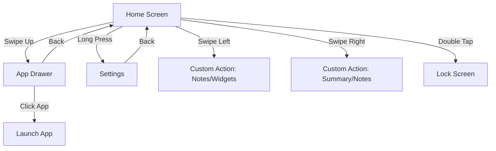

<p align="center">
  
</p>

<h1 align="center">VOID Launcher</h1>

<p align="center">
  <em>A radically minimalist, high-performance Android launcher designed to combat digital addiction.</em>
</p>

<p align="center">
  
  
  
  
  
  
</p>

---

## 🌑 Philosophy

**VOID** is built on the principle of intentionality. By stripping away colorful icons, notification badges, and complex grid layouts, VOID eliminates the psychological triggers that lead to mindless scrolling. It provides a hyper-clean, text-based interface where you are in control of your phone, not the other way around.

---

## ✨ Core Features

- **Text-Only Home Screen**: Pin up to 10 of your most essential apps as clean text labels. No icons, no distractions.
- **Smart Notification Grouping**: A dedicated screen that groups system notifications by app with smart summaries, categorized by conversation.
- **On-Device AI Summarization**: Uses Gemini Nano (via ML Kit) to summarize your notifications locally, ensuring privacy and speed.
- **Integrated Quick Notes**: Fast, text-based checklist for capturing thoughts instantly with priority ordering and reminders.
- **Deep Android 15 Integration**: Full support for Private Space, allowing you to access hidden and secure apps directly from the drawer.
- **Digital Wellbeing**: Screen time and unlock counts are integrated directly into the home screen for at-a-glance awareness.
- **Fluid Gestures**: Intuitive navigation with swipe gestures for Apps, Notifications, and Custom Actions (Notes/Widgets).
- **Modern UI**: Built with 100% Jetpack Compose and Material 3, providing smooth animations and dynamic theme support.

---

## 📱 Screen Flow & Navigation

Navigate your device with a simple, gesture-based mental model:



---

## 🛠 Technical Architecture

VOID Launcher leverages the latest Android development stack for maximum performance and a minimal footprint.

- **UI Framework**: [Jetpack Compose](https://developer.android.com/compose) with [Material 3](https://m3.material.io/).
- **Programming Language**: 100% Kotlin.
- **State Management**: Clean Architecture with Fragments/Single-Activity and shared `MainViewModel` using Kotlin Coroutines and Flow.
- **Intelligence**: Integrated with **ML Kit GenAI** for on-device notification processing.
- **Background Tasks**: Powered by `WorkManager` for reliable, low-impact operations like wallpaper updates.
- **Persistence**: Hybrid approach using `SharedPreferences` and JSON for lightweight, fast data access.

---

## 🚀 Getting Started

### Prerequisites
- **Android Studio Koala** (or newer)
- **JDK 17** or **JDK 21**
- **Android SDK Platform 35**

### Building from Source

```bash
# Clone the repository
git clone https://github.com/knownassurajit/void.git
cd void

# Build a debug APK for the desired flavor
./gradlew clean assembleIntegratedDebug      # full feature set
./gradlew clean assembleDisintegratedDebug   # Play-policy compliant
```

Output APKs land under `build/outputs/apk/{integrated|disintegrated}/debug/`.

---

## 🛡 Privacy & Security

VOID is designed with privacy as a first-class citizen:
- **No Ads. No Tracking.**
- **Local AI**: All summarization happens on-device using Gemini Nano. Your data never leaves your phone.
- **Open Source**: The code is fully transparent and open for audit.

---

## 📄 License & Credits

VOID is a heavily restructured and modernized fork of **Olauncher**. We credit the original project for the foundational concept of a minimalist, text-based launcher.

- **License**: This project is licensed under the [GNU General Public License v3.0](https://www.gnu.org/licenses/gpl-3.0.en.html).
- **Original Base**: [Olauncher](https://github.com/tanujnotes/olauncher) by Tanuj.
- **Typography**: Inter (RSMS) and Google Sans.
- **Icons**: Material Symbols (Google).

---

<p align="center">
  <em>“Are you using your phone, or is your phone using you?”</em>
</p>
