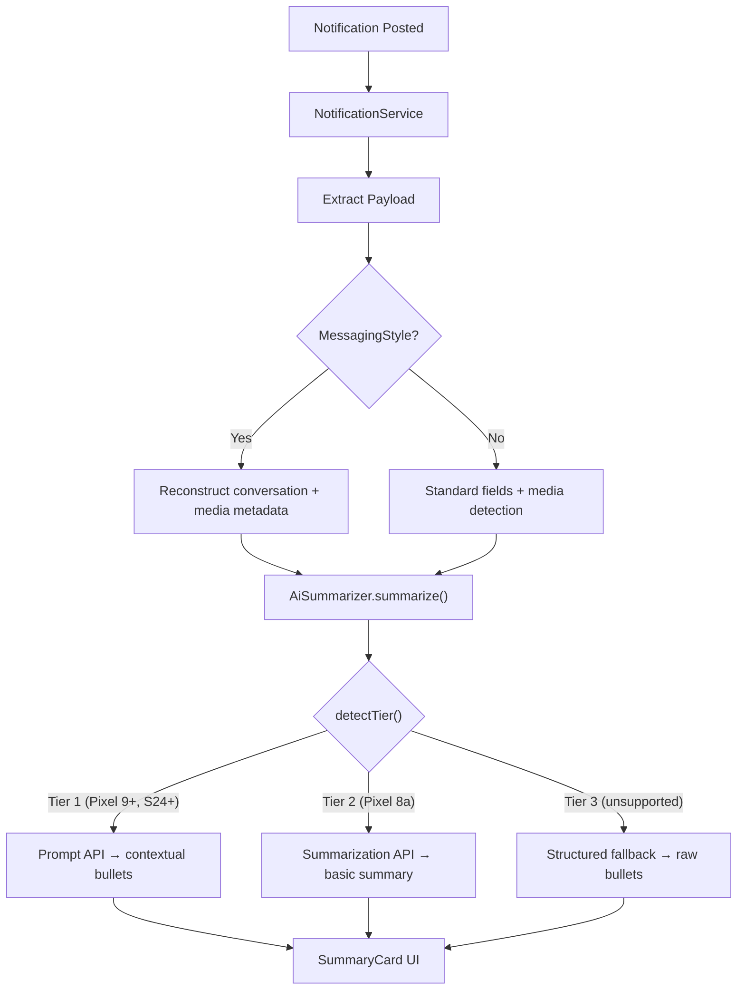

# Walkthrough — Tiered On-Device Notification Summarization

## Summary

Implemented a 3-tier AI engine for contextual notification summarization that adapts to device capabilities at runtime — supporting the broadest possible device matrix without cloud dependency.

## Architecture



## Changes Made

### [build.gradle](file:///Users/knownassurajit/Documents/Codes/GitHub/void/app/build.gradle)
```diff:build.gradle
apply plugin: 'com.android.application'
apply plugin: 'kotlin-android'
apply plugin: 'org.jetbrains.kotlin.plugin.serialization'
apply plugin: 'org.jetbrains.kotlin.plugin.compose'

android {
    compileSdk 35

    compileOptions {
        sourceCompatibility JavaVersion.VERSION_17
        targetCompatibility JavaVersion.VERSION_17
    }

    kotlinOptions {
        jvmTarget = JavaVersion.VERSION_17.toString()
    }

    defaultConfig {
        applicationId "com.launcher.void"
        minSdkVersion 26
        targetSdkVersion 35
        versionCode 97
        versionName "v6.2.18"

        resourceConfigurations += ["en", "ar", "de", "es-rES", "es-rUS", "fr", "he", "hr", "hu", "in", "it", "ja", "nl", "pl", "pt-rBR", "ru-rRU", "sv", "tr", "uk", "zh"]
        testInstrumentationRunner "androidx.test.runner.AndroidJUnitRunner"
    }

    buildTypes {
        release {
            debuggable false
            minifyEnabled true
            shrinkResources true
            proguardFiles getDefaultProguardFile('proguard-android-optimize.txt')
        }
        debug {
            debuggable true
            minifyEnabled false
            applicationIdSuffix ".debug"
            proguardFiles getDefaultProguardFile('proguard-android-optimize.txt')
        }
    }
    buildFeatures {
        compose = true
        buildConfig = true
    }
    composeOptions {
        kotlinCompilerExtensionVersion '2.0.21'
    }
    namespace 'com.launcher.projectvoid'
}

dependencies {
    implementation fileTree(dir: "libs", include: ["*.jar"])
    implementation libs.kotlin.stdlib
    implementation libs.core.ktx

    // Android lifecycle
    implementation libs.lifecycle.process

    // Work Manager
    implementation libs.work.runtime.ktx

    // Material dependency
    implementation libs.material

    // Compose — MD3 Expressive (BOM 2025.05.01 includes M3 1.4+)
    implementation platform('androidx.compose:compose-bom:2025.05.01')
    androidTestImplementation platform('androidx.compose:compose-bom:2025.05.01')
    implementation 'androidx.activity:activity-compose:1.10.1'
    implementation 'androidx.compose.ui:ui'
    implementation 'androidx.compose.ui:ui-tooling-preview'
    implementation 'androidx.compose.material3:material3'
    implementation 'androidx.compose.material:material-icons-core'
    implementation 'androidx.compose.material:material-icons-extended'
    implementation 'androidx.navigation:navigation-compose:2.8.9'
    implementation 'androidx.lifecycle:lifecycle-runtime-compose:2.8.7'
    implementation 'androidx.lifecycle:lifecycle-viewmodel-compose:2.8.7'
    implementation 'org.jetbrains.kotlinx:kotlinx-serialization-json:1.7.3'
    debugImplementation 'androidx.compose.ui:ui-tooling'

    // App Optimization (Baseline Profiles)
    implementation "androidx.profileinstaller:profileinstaller:1.4.1"

    // On-device AI — Gemini Nano via ML Kit GenAI (AICore)
    implementation 'com.google.mlkit:genai-summarization:1.0.0-beta1'
    implementation 'org.jetbrains.kotlinx:kotlinx-coroutines-play-services:1.8.1'

    testImplementation 'junit:junit:4.13.2'

}
===
apply plugin: 'com.android.application'
apply plugin: 'kotlin-android'
apply plugin: 'org.jetbrains.kotlin.plugin.serialization'
apply plugin: 'org.jetbrains.kotlin.plugin.compose'

android {
    compileSdk 35

    compileOptions {
        sourceCompatibility JavaVersion.VERSION_17
        targetCompatibility JavaVersion.VERSION_17
    }

    kotlinOptions {
        jvmTarget = JavaVersion.VERSION_17.toString()
    }

    defaultConfig {
        applicationId "com.launcher.void"
        minSdkVersion 26
        targetSdkVersion 35
        versionCode 97
        versionName "v6.2.18"

        resourceConfigurations += ["en", "ar", "de", "es-rES", "es-rUS", "fr", "he", "hr", "hu", "in", "it", "ja", "nl", "pl", "pt-rBR", "ru-rRU", "sv", "tr", "uk", "zh"]
        testInstrumentationRunner "androidx.test.runner.AndroidJUnitRunner"
    }

    buildTypes {
        release {
            debuggable false
            minifyEnabled true
            shrinkResources true
            proguardFiles getDefaultProguardFile('proguard-android-optimize.txt')
        }
        debug {
            debuggable true
            minifyEnabled false
            applicationIdSuffix ".debug"
            proguardFiles getDefaultProguardFile('proguard-android-optimize.txt')
        }
    }
    buildFeatures {
        compose = true
        buildConfig = true
    }
    composeOptions {
        kotlinCompilerExtensionVersion '2.0.21'
    }
    namespace 'com.launcher.projectvoid'
}

dependencies {
    implementation fileTree(dir: "libs", include: ["*.jar"])
    implementation libs.kotlin.stdlib
    implementation libs.core.ktx

    // Android lifecycle
    implementation libs.lifecycle.process

    // Work Manager
    implementation libs.work.runtime.ktx

    // Material dependency
    implementation libs.material

    // Compose — MD3 Expressive (BOM 2025.05.01 includes M3 1.4+)
    implementation platform('androidx.compose:compose-bom:2025.05.01')
    androidTestImplementation platform('androidx.compose:compose-bom:2025.05.01')
    implementation 'androidx.activity:activity-compose:1.10.1'
    implementation 'androidx.compose.ui:ui'
    implementation 'androidx.compose.ui:ui-tooling-preview'
    implementation 'androidx.compose.material3:material3'
    implementation 'androidx.compose.material:material-icons-core'
    implementation 'androidx.compose.material:material-icons-extended'
    implementation 'androidx.navigation:navigation-compose:2.8.9'
    implementation 'androidx.lifecycle:lifecycle-runtime-compose:2.8.7'
    implementation 'androidx.lifecycle:lifecycle-viewmodel-compose:2.8.7'
    implementation 'org.jetbrains.kotlinx:kotlinx-serialization-json:1.7.3'
    implementation 'androidx.compose.ui:ui-text-google-fonts:1.7.8'
    debugImplementation 'androidx.compose.ui:ui-tooling'

    // App Optimization (Baseline Profiles)
    implementation "androidx.profileinstaller:profileinstaller:1.4.1"

    // On-device AI — Gemini Nano via ML Kit GenAI (AICore)
    implementation 'com.google.mlkit:genai-summarization:1.0.0-beta1'  // Tier 2: older AICore devices
    implementation 'com.google.mlkit:genai-prompt:1.0.0-beta2'         // Tier 1: latest AICore devices
    implementation 'org.jetbrains.kotlinx:kotlinx-coroutines-play-services:1.8.1'

    testImplementation 'junit:junit:4.13.2'

}
```

Added `genai-prompt:1.0.0-beta2` alongside existing `genai-summarization:1.0.0-beta1`.

---

### [AiSummarizer.kt](file:///Users/knownassurajit/Documents/Codes/GitHub/void/app/src/main/java/com/launcher/projectvoid/helper/AiSummarizer.kt)
```diff:AiSummarizer.kt
package com.launcher.projectvoid.helper

import android.content.Context
import kotlinx.coroutines.Dispatchers
import kotlinx.coroutines.withContext
import kotlin.coroutines.resume
import kotlin.coroutines.resumeWithException

/**
 * On-device notification summarization via Google ML Kit GenAI Summarization API.
 *
 * Uses Gemini Nano through the ML Kit GenAI Summarization API when available.
 * Falls back gracefully with null on unsupported devices.
 *
 * The API is accessed via reflection to handle version differences across
 * ML Kit GenAI releases. Requires com.google.mlkit:genai-summarization 
 * dependency and a device with AICore installed (Pixel 8+, Samsung Galaxy S24+, etc.)
 */
class AiSummarizer(private val context: Context) {

    @Volatile
    private var available: Boolean? = null

    /**
     * Check if AICore / ML Kit GenAI is available on this device.
     */
    suspend fun isAvailable(): Boolean {
        available?.let { return it }
        return withContext(Dispatchers.IO) {
            try {
                // Check if AICore is installed on device
                context.packageManager.getPackageInfo("com.google.android.aicore", 0)
                available = true
                true
            } catch (e: Exception) {
                available = false
                false
            }
        }
    }

    /**
     * Summarize a list of notification texts from one app.
     * Returns null if AI is unavailable or inference fails.
     * Falls back to a simple concatenation if AI summarization fails.
     */
    suspend fun summarize(appName: String, notificationTexts: List<String>): String? {
        if (!isAvailable()) return null
        if (notificationTexts.isEmpty()) return null

        return withContext(Dispatchers.IO) {
            try {
                // Try ML Kit GenAI via reflection to handle API differences
                val summClass = Class.forName("com.google.mlkit.genai.summarization.Summarization")
                val getClient = summClass.methods.firstOrNull { it.name == "getClient" }
                    ?: return@withContext fallbackSummarize(notificationTexts)
                
                val client = if (getClient.parameterCount == 0) {
                    getClient.invoke(null)
                } else {
                    getClient.invoke(null, context)
                } ?: return@withContext fallbackSummarize(notificationTexts)

                // Check feature status
                val checkMethod = client.javaClass.methods.firstOrNull { it.name == "checkFeatureStatus" }
                if (checkMethod != null) {
                    val statusTask = checkMethod.invoke(client)
                    val statusResult = awaitGmsTask<Any>(statusTask)
                    // If status is non-zero (unavailable), fall back
                    if (statusResult is Int && statusResult != 0) {
                        return@withContext fallbackSummarize(notificationTexts)
                    }
                }

                // Build input text
                val inputText = buildString {
                    appendLine("Summarize these notifications from $appName in 1-2 concise sentences:")
                    notificationTexts.forEach { line ->
                        appendLine("- $line")
                    }
                }

                // Try to run inference
                val inferMethod = client.javaClass.methods.firstOrNull { 
                    it.name == "runInference" && it.parameterCount == 1 
                }
                
                if (inferMethod != null) {
                    // Check if parameter is String or needs a Request object
                    val paramType = inferMethod.parameterTypes[0]
                    val param = if (paramType == String::class.java) {
                        inputText
                    } else {
                        // Try creating a SummarizationRequest via builder
                        try {
                            val reqClass = Class.forName("com.google.mlkit.genai.summarization.SummarizationRequest")
                            val builderMethod = reqClass.getMethod("builder", String::class.java)
                            val builder = builderMethod.invoke(null, inputText)
                            val buildMethod = builder.javaClass.getMethod("build")
                            buildMethod.invoke(builder)
                        } catch (_: Exception) {
                            inputText // fallback to raw string
                        }
                    }
                    
                    val inferTask = inferMethod.invoke(client, param)
                    val result = awaitGmsTask<Any>(inferTask)
                    result?.toString() ?: fallbackSummarize(notificationTexts)
                } else {
                    fallbackSummarize(notificationTexts)
                }
            } catch (e: Exception) {
                // AI failed — provide clean fallback
                fallbackSummarize(notificationTexts)
            }
        }
    }

    /**
     * Simple concatenation fallback when AI is unavailable.
     */
    private fun fallbackSummarize(texts: List<String>): String {
        return texts.take(3).joinToString(". ") + if (texts.size > 3) " (+${texts.size - 3} more)" else ""
    }

    @Suppress("UNCHECKED_CAST")
    private suspend fun <T> awaitGmsTask(task: Any): T? = withContext(Dispatchers.IO) {
        kotlinx.coroutines.suspendCancellableCoroutine { cont ->
            try {
                val successListenerClass = Class.forName("com.google.android.gms.tasks.OnSuccessListener")
                val failureListenerClass = Class.forName("com.google.android.gms.tasks.OnFailureListener")

                val addSuccess = task.javaClass.getMethod("addOnSuccessListener", successListenerClass)
                val addFailure = task.javaClass.getMethod("addOnFailureListener", failureListenerClass)

                val successProxy = java.lang.reflect.Proxy.newProxyInstance(
                    task.javaClass.classLoader,
                    arrayOf(successListenerClass)
                ) { _, _, args ->
                    if (cont.isActive) cont.resume(args?.firstOrNull() as? T)
                    null
                }

                val failureProxy = java.lang.reflect.Proxy.newProxyInstance(
                    task.javaClass.classLoader,
                    arrayOf(failureListenerClass)
                ) { _, _, args ->
                    if (cont.isActive) {
                        val ex = args?.firstOrNull() as? Exception ?: RuntimeException("Unknown GMS error")
                        cont.resumeWithException(ex)
                    }
                    null
                }

                addSuccess.invoke(task, successProxy)
                addFailure.invoke(task, failureProxy)
            } catch (e: Exception) {
                if (cont.isActive) cont.resume(null)
            }
        }
    }
}
===
package com.launcher.projectvoid.helper

import android.content.Context
import android.util.Log
import kotlinx.coroutines.Dispatchers
import kotlinx.coroutines.withContext
import kotlin.coroutines.resumeWithException

/**
 * On-device notification summarization with tiered AI engine selection.
 *
 * Tier 1 — ML Kit GenAI Prompt API (genai-prompt:1.0.0-beta2)
 *   Full contextual summarization with custom prompt engineering.
 *   Supported on: Pixel 9+, Galaxy S24+, Xiaomi 14T Pro+, etc.
 *
 * Tier 2 — ML Kit GenAI Summarization API (genai-summarization:1.0.0-beta1)
 *   Basic AI summarization with LoRA adapter.
 *   Supported on: Pixel 8a and older AICore devices.
 *
 * Tier 3 — Structured fallback (no AI)
 *   Clean bullet-point formatting of raw notification text.
 *   Works on all devices regardless of hardware.
 *
 * The engine probes Tier 1 first, falls back to Tier 2, then Tier 3.
 * All inference is on-device via Android AICore — zero cloud calls.
 */
@OptIn(kotlinx.coroutines.ExperimentalCoroutinesApi::class)
class AiSummarizer(private val context: Context) {

    companion object {
        private const val TAG = "AiSummarizer"

        /** Deterministic prompt for Gemini Nano via Prompt API. */
        private const val SYSTEM_PROMPT = """ROLE: You are a concise notification summarizer.
STRICT RULES:
1. Output ONLY a bulleted list. Start each line with "• ".
2. One bullet per notification. Preserve ALL numbers, OTPs, dates, and amounts exactly.
3. For media attachments, mention the media type (image/video/audio) contextually without describing the media content itself.
4. Be maximally concise — no filler, no introductions, no conclusions.
5. If there is only one notification, output one bullet.
6. Summarize the core intent or action of each notification."""
    }

    /** Detected engine tier: 1 = Prompt, 2 = Summarization, 3 = Fallback, null = not yet probed. */
    @Volatile
    private var detectedTier: Int? = null

    // Tier 1: Prompt API client (lazy, nullable)
    private var promptClient: com.google.mlkit.genai.prompt.GenerativeModel? = null

    /**
     * Check if any on-device AI is available and determine the engine tier.
     * Returns true for Tier 1 or 2, false for Tier 3.
     */
    suspend fun isAvailable(): Boolean {
        detectedTier?.let { return it <= 2 }
        return withContext(Dispatchers.IO) {
            detectTier() <= 2
        }
    }

    /**
     * Returns the detected tier (1, 2, or 3). Probes if not yet determined.
     */
    suspend fun getTier(): Int {
        detectedTier?.let { return it }
        return withContext(Dispatchers.IO) { detectTier() }
    }

    /**
     * Probe device capabilities and select the best engine tier.
     * Must be called on a background thread.
     */
    private fun detectTier(): Int {
        // First, check if AICore is even installed
        val hasAiCore = try {
            context.packageManager.getPackageInfo("com.google.android.aicore", 0)
            true
        } catch (_: Exception) {
            false
        }

        if (!hasAiCore) {
            Log.d(TAG, "AICore not installed → Tier 3 (fallback)")
            detectedTier = 3
            return 3
        }

        // Try Tier 1: Prompt API
        try {
            val client = com.google.mlkit.genai.prompt.Generation.getClient()
            val status = kotlinx.coroutines.runBlocking {
                client.checkStatus()
            }
            val statusValue = status as? Int ?: -1
            // FeatureStatus.AVAILABLE = 0, DOWNLOADABLE = 1
            if (statusValue == 0 || statusValue == 1) {
                promptClient = client
                detectedTier = 1
                Log.d(TAG, "Prompt API available → Tier 1 (contextual)")
                return 1
            }
        } catch (e: Exception) {
            Log.d(TAG, "Prompt API probe failed: ${e.message}")
        }

        // Try Tier 2: Summarization API
        try {
            val summClass = Class.forName("com.google.mlkit.genai.summarization.Summarization")
            val getClient = summClass.methods.firstOrNull { it.name == "getClient" }
            if (getClient != null) {
                val client = if (getClient.parameterCount == 0) {
                    getClient.invoke(null)
                } else {
                    getClient.invoke(null, context)
                }
                if (client != null) {
                    val checkMethod = client.javaClass.methods.firstOrNull { it.name == "checkFeatureStatus" }
                    if (checkMethod != null) {
                        val statusTask = checkMethod.invoke(client)
                        val statusResult = awaitGmsTask<Any>(statusTask)
                        if (statusResult is Int && statusResult <= 1) {
                            detectedTier = 2
                            Log.d(TAG, "Summarization API available → Tier 2 (basic)")
                            return 2
                        }
                    }
                }
            }
        } catch (e: Exception) {
            Log.d(TAG, "Summarization API probe failed: ${e.message}")
        }

        Log.d(TAG, "No AI engine available → Tier 3 (fallback)")
        detectedTier = 3
        return 3
    }

    /**
     * Summarize notifications from a single application.
     *
     * @param appName Display name of the originating application.
     * @param notificationTexts List of extracted notification strings (may include media metadata markers).
     * @return Bulleted summary string, or null if summarization failed entirely.
     */
    suspend fun summarize(appName: String, notificationTexts: List<String>): String? {
        if (notificationTexts.isEmpty()) return null

        val tier = getTier()
        return withContext(Dispatchers.IO) {
            when (tier) {
                1 -> summarizeWithPromptApi(appName, notificationTexts)
                2 -> summarizeWithSummarizationApi(appName, notificationTexts)
                else -> fallbackSummarize(notificationTexts)
            }
        }
    }

    // ── Tier 1: Prompt API ──────────────────────────────────────────────

    private suspend fun summarizeWithPromptApi(appName: String, texts: List<String>): String {
        try {
            val client = promptClient ?: com.google.mlkit.genai.prompt.Generation.getClient()
            promptClient = client

            // Build the notification payload with XML delimiters for prompt injection safety
            val payload = buildString {
                appendLine(SYSTEM_PROMPT)
                appendLine()
                appendLine("<notifications app=\"$appName\">")
                // Token budget: ~3000 words max. Truncate oldest if too long.
                val truncated = truncateForTokenBudget(texts)
                truncated.forEachIndexed { i, text ->
                    appendLine("[${i + 1}] $text")
                }
                appendLine("</notifications>")
                appendLine()
                appendLine("SUMMARY:")
            }

            // Build request with deterministic parameters
            val request = com.google.mlkit.genai.prompt.generateContentRequest(
                com.google.mlkit.genai.prompt.TextPart(payload)
            ) {
                temperature = 0.1f
                topK = 5
                maxOutputTokens = 256
            }

            val response = client.generateContent(request)
            val result = response.candidates.firstOrNull()?.text
            if (!result.isNullOrBlank()) {
                return result.trim()
            }
        } catch (e: Exception) {
            Log.e(TAG, "Prompt API inference failed: ${e.message}")
        }
        // Fallback if Prompt API fails at runtime
        return fallbackSummarize(texts)
    }

    // ── Tier 2: Summarization API ───────────────────────────────────────

    private suspend fun summarizeWithSummarizationApi(appName: String, texts: List<String>): String {
        try {
            val summClass = Class.forName("com.google.mlkit.genai.summarization.Summarization")
            val getClient = summClass.methods.firstOrNull { it.name == "getClient" }
                ?: return fallbackSummarize(texts)

            val client = if (getClient.parameterCount == 0) {
                getClient.invoke(null)
            } else {
                getClient.invoke(null, context)
            } ?: return fallbackSummarize(texts)

            val inputText = buildString {
                appendLine("Notifications from $appName:")
                texts.forEach { line ->
                    appendLine("- $line")
                }
            }

            val inferMethod = client.javaClass.methods.firstOrNull {
                it.name == "runInference" && it.parameterCount == 1
            }

            if (inferMethod != null) {
                val paramType = inferMethod.parameterTypes[0]
                val param = if (paramType == String::class.java) {
                    inputText
                } else {
                    try {
                        val reqClass = Class.forName("com.google.mlkit.genai.summarization.SummarizationRequest")
                        val builderMethod = reqClass.getMethod("builder", String::class.java)
                        val builder = builderMethod.invoke(null, inputText)
                        val buildMethod = builder.javaClass.getMethod("build")
                        buildMethod.invoke(builder)
                    } catch (_: Exception) {
                        inputText
                    }
                }

                val inferTask = inferMethod.invoke(client, param)
                val result = awaitGmsTask<Any>(inferTask)
                result?.toString()?.let { summary ->
                    if (summary.isNotBlank()) return summary
                }
            }
        } catch (e: Exception) {
            Log.e(TAG, "Summarization API inference failed: ${e.message}")
        }
        return fallbackSummarize(texts)
    }

    // ── Tier 3: Structured Fallback ─────────────────────────────────────

    /**
     * Structured bullet-point formatting of raw notification text.
     * No AI involved — works on every device.
     */
    private fun fallbackSummarize(texts: List<String>): String {
        return texts.joinToString("\n") { "• $it" }
    }

    // ── Utilities ───────────────────────────────────────────────────────

    /**
     * Truncate notification list to fit within ~3000 word token budget.
     * Drops oldest (first) entries, retaining the most recent.
     */
    private fun truncateForTokenBudget(texts: List<String>, maxWords: Int = 2800): List<String> {
        var totalWords = 0
        val result = mutableListOf<String>()
        // Iterate from newest (last) to oldest (first)
        for (text in texts.reversed()) {
            val wordCount = text.split("\\s+".toRegex()).size
            if (totalWords + wordCount > maxWords && result.isNotEmpty()) break
            result.add(0, text)
            totalWords += wordCount
        }
        return result
    }

    @Suppress("UNCHECKED_CAST")
    private fun <T> awaitGmsTask(task: Any): T? {
        return try {
            kotlinx.coroutines.runBlocking {
                kotlinx.coroutines.suspendCancellableCoroutine { cont ->
                    try {
                        val successListenerClass = Class.forName("com.google.android.gms.tasks.OnSuccessListener")
                        val failureListenerClass = Class.forName("com.google.android.gms.tasks.OnFailureListener")

                        val addSuccess = task.javaClass.getMethod("addOnSuccessListener", successListenerClass)
                        val addFailure = task.javaClass.getMethod("addOnFailureListener", failureListenerClass)

                        val successProxy = java.lang.reflect.Proxy.newProxyInstance(
                            task.javaClass.classLoader,
                            arrayOf(successListenerClass)
                        ) { _, _, args ->
                            if (cont.isActive) cont.resume(args?.firstOrNull() as? T) {}
                            null
                        }

                        val failureProxy = java.lang.reflect.Proxy.newProxyInstance(
                            task.javaClass.classLoader,
                            arrayOf(failureListenerClass)
                        ) { _, _, args ->
                            if (cont.isActive) {
                                val ex = args?.firstOrNull() as? Exception ?: RuntimeException("Unknown GMS error")
                                cont.resumeWithException(ex)
                            }
                            null
                        }

                        addSuccess.invoke(task, successProxy)
                        addFailure.invoke(task, failureProxy)
                    } catch (e: Exception) {
                        if (cont.isActive) cont.resume(null) {}
                    }
                }
            }
        } catch (_: Exception) {
            null
        }
    }
}
```

**Complete rewrite** with tiered engine:

| Tier | API | Devices | Prompt | Output |
|------|-----|---------|--------|--------|
| 1 | `genai-prompt` | Pixel 9+, Galaxy S24+, Xiaomi 14T Pro+ | Custom deterministic prompt with XML delimiters | Per-notification contextual bullets |
| 2 | `genai-summarization` | Pixel 8a, older AICore | LoRA adapter (hidden prompt) | 1-3 generic bullets |
| 3 | None | All others | N/A | Formatted raw text bullets |

**Key design decisions:**
- **Runtime detection**: Probes Tier 1 → 2 → 3 sequentially. Caches result.
- **Deterministic prompt**: `temperature=0.1` + `topK=5` preserves OTPs, amounts, dates verbatim.
- **Token truncation**: Auto-drops oldest notifications when approaching 4096 token limit.
- **Media metadata**: Only text markers (`[Image attached]`) — no binary processing.

---

### [NotificationSummaryScreen.kt](file:///Users/knownassurajit/Documents/Codes/GitHub/void/app/src/main/java/com/launcher/projectvoid/ui/screen/NotificationSummaryScreen.kt)
```diff:NotificationSummaryScreen.kt
package com.launcher.projectvoid.ui.screen

import android.app.Application
import android.app.Notification
import android.os.Bundle
import android.text.format.DateUtils
import android.util.Log
import androidx.compose.animation.animateContentSize
import androidx.compose.foundation.background
import androidx.compose.foundation.gestures.detectDragGestures
import androidx.compose.foundation.layout.Arrangement
import androidx.compose.foundation.layout.Box
import androidx.compose.foundation.layout.Column
import androidx.compose.foundation.layout.Row
import androidx.compose.foundation.layout.Spacer
import androidx.compose.foundation.layout.fillMaxSize
import androidx.compose.foundation.layout.fillMaxWidth
import androidx.compose.foundation.layout.height
import androidx.compose.foundation.layout.padding
import androidx.compose.foundation.layout.size
import androidx.compose.foundation.layout.width
import androidx.compose.foundation.lazy.LazyColumn
import androidx.compose.foundation.lazy.items
import androidx.compose.foundation.shape.CircleShape
import androidx.compose.material3.CardDefaults
import androidx.compose.material3.HorizontalDivider
import androidx.compose.material3.MaterialTheme
import androidx.compose.material3.OutlinedCard
import androidx.compose.material3.SwipeToDismissBox
import androidx.compose.material3.SwipeToDismissBoxValue
import androidx.compose.material3.Text
import androidx.compose.material3.rememberSwipeToDismissBoxState
import androidx.compose.runtime.Composable
import androidx.compose.runtime.collectAsState
import androidx.compose.runtime.getValue
import androidx.compose.runtime.remember
import androidx.compose.ui.Alignment
import androidx.compose.ui.Modifier
import androidx.compose.ui.draw.clip
import androidx.compose.ui.platform.LocalContext
import androidx.compose.ui.text.font.FontWeight
import androidx.compose.ui.text.style.TextOverflow
import androidx.compose.ui.unit.dp
import androidx.lifecycle.AndroidViewModel
import androidx.lifecycle.viewModelScope
import androidx.lifecycle.viewmodel.compose.viewModel
import com.launcher.projectvoid.data.AppNotificationSummary
import com.launcher.projectvoid.helper.AiSummarizer
import com.launcher.projectvoid.helper.NotificationService
import kotlinx.coroutines.Job
import kotlinx.coroutines.flow.MutableStateFlow
import kotlinx.coroutines.flow.StateFlow
import kotlinx.coroutines.flow.asStateFlow
import kotlinx.coroutines.flow.collectLatest
import kotlinx.coroutines.flow.debounce
import kotlinx.coroutines.launch
import androidx.compose.runtime.mutableStateOf
import androidx.compose.runtime.setValue
import androidx.compose.ui.geometry.Offset
import androidx.compose.ui.input.pointer.pointerInput
import kotlin.math.abs

// ── ViewModel ──

class NotificationSummaryViewModel(application: Application) : AndroidViewModel(application) {
    companion object {
        private const val TAG = "NotificationSummaryVM"
        private const val SUMMARY_DEBOUNCE_MS = 250L
    }

    private val summarizer = AiSummarizer(application.applicationContext)
    private val summaryJobs = mutableMapOf<String, Job>()
    private var generation = 0L

    private val _summaries = MutableStateFlow<List<AppNotificationSummary>>(emptyList())
    val summaries: StateFlow<List<AppNotificationSummary>> = _summaries.asStateFlow()

    private val _isAiAvailable = MutableStateFlow<Boolean?>(null)
    val isAiAvailable: StateFlow<Boolean?> = _isAiAvailable.asStateFlow()

    init {
        viewModelScope.launch {
            _isAiAvailable.value = summarizer.isAvailable()
        }

        viewModelScope.launch {
            NotificationService.notificationsState.collect { groups ->
                generation += 1
                val currentGeneration = generation
                val activePackages = groups.map { it.packageName }.toSet()
                summaryJobs.keys.filter { it !in activePackages }.forEach { pkg ->
                    summaryJobs.remove(pkg)?.cancel()
                }

                val summaryList = groups
                    .sortedByDescending { it.latestTimestamp }
                    .map { group ->
                        AppNotificationSummary(
                            packageName = group.packageName,
                            appLabel = group.appLabel,
                            notifications = group.notifications,
                            latestTimestamp = group.latestTimestamp,
                            isLoading = true
                        )
                    }

                _summaries.value = summaryList

                // Generate AI summaries in background
                summaryList.forEach { summary ->
                    summaryJobs[summary.packageName]?.cancel()
                    summaryJobs[summary.packageName] = launch {
                        val texts = extractNotificationTexts(summary.notifications)

                        val aiResult = summarizer.summarize(summary.appLabel, texts)
                        if (currentGeneration != generation) return@launch

                        val fallbackSummary = texts.joinToString(". ")
                        _summaries.value = _summaries.value.map { current ->
                            if (current.packageName == summary.packageName) {
                                current.copy(
                                    aiSummary = aiResult ?: fallbackSummary,
                                    isLoading = false
                                )
                            } else {
                                current
                            }
                        }
                    }
                }
            }
        }
    }

    fun dismissApp(packageName: String) {
        summaryJobs.remove(packageName)?.cancel()
        NotificationService.dismissNotificationsForPackage(packageName)
        _summaries.value = _summaries.value.filter { it.packageName != packageName }
    }

    private fun extractNotificationTexts(notifications: List<android.service.notification.StatusBarNotification>): List<String> {
        return notifications.mapNotNull { sbn ->
            val extras = sbn.notification.extras
            val title = extras.getCharSequence("android.title")?.toString()?.trim().orEmpty()
            val text = extras.getCharSequence("android.text")?.toString()?.trim().orEmpty()
            val bigText = extras.getCharSequence("android.bigText")?.toString()?.trim().orEmpty()
            val lines = extras.getCharSequenceArray("android.textLines")
                ?.map { it.toString().trim() }
                ?.filter { it.isNotBlank() }
                .orEmpty()

            when {
                title.isNotBlank() && bigText.isNotBlank() -> "$title: $bigText"
                title.isNotBlank() && text.isNotBlank() -> "$title: $text"
                bigText.isNotBlank() -> bigText
                text.isNotBlank() -> text
                lines.isNotEmpty() -> lines.joinToString(" • ")
                title.isNotBlank() -> title
                else -> null
            }
        }
    }
}

// ── Screen ──

@Composable
fun NotificationSummaryScreen(
    onBack: () -> Unit,
    viewModel: NotificationSummaryViewModel = viewModel()
) {
    val summaries by viewModel.summaries.collectAsState()
    val aiAvailable by viewModel.isAiAvailable.collectAsState()
    var dragOffset by remember { mutableStateOf(Offset.Zero) }

    Box(
        modifier = Modifier
            .fillMaxSize()
            .padding(top = 48.dp, bottom = 24.dp)
    ) {
    Column(
        modifier = Modifier
            .fillMaxSize()
    ) {
        // Header
        Row(
            modifier = Modifier
                .fillMaxWidth()
                .padding(start = 20.dp, end = 20.dp, top = 20.dp, bottom = 8.dp),
            verticalAlignment = Alignment.CenterVertically,
            horizontalArrangement = Arrangement.SpaceBetween
        ) {
            Text(
                text = "Notification Summary",
                style = MaterialTheme.typography.headlineSmall,
                color = MaterialTheme.colorScheme.onBackground,
                fontWeight = FontWeight.Medium
            )
            // Total notification count badge
            val totalCount = summaries.sumOf { it.notifications.size }
            if (totalCount > 0) {
                Box(
                    modifier = Modifier
                        .size(28.dp)
                        .clip(CircleShape)
                        .background(MaterialTheme.colorScheme.primaryContainer),
                    contentAlignment = Alignment.Center
                ) {
                    Text(
                        text = "$totalCount",
                        style = MaterialTheme.typography.labelSmall,
                        color = MaterialTheme.colorScheme.onPrimaryContainer,
                        fontWeight = FontWeight.Medium
                    )
                }
            }
        }

        if (aiAvailable == false) {
            Text(
                text = "On-device AI summary is not available on this device. Displaying raw notification content.",
                style = MaterialTheme.typography.bodySmall,
                color = MaterialTheme.colorScheme.onSurfaceVariant,
                modifier = Modifier.padding(horizontal = 20.dp, vertical = 4.dp)
            )
        }

        HorizontalDivider(
            modifier = Modifier.padding(horizontal = 20.dp),
            color = MaterialTheme.colorScheme.outlineVariant
        )

        if (summaries.isEmpty()) {
            Box(
                modifier = Modifier
                    .weight(1f)
                    .fillMaxWidth(),
                contentAlignment = Alignment.Center
            ) {
                Column(horizontalAlignment = Alignment.CenterHorizontally) {
                    Text(
                        text = "All clear",
                        style = MaterialTheme.typography.titleMedium,
                        color = MaterialTheme.colorScheme.onSurfaceVariant,
                        fontWeight = FontWeight.Medium
                    )
                    Spacer(modifier = Modifier.height(4.dp))
                    Text(
                        text = "No pending notifications to summarize",
                        style = MaterialTheme.typography.bodySmall,
                        color = MaterialTheme.colorScheme.onSurfaceVariant.copy(alpha = 0.6f)
                    )
                }
            }
        } else {
            LazyColumn(
                modifier = Modifier
                    .weight(1f)
                    .padding(horizontal = 12.dp, vertical = 8.dp),
                verticalArrangement = Arrangement.spacedBy(8.dp)
            ) {
                items(
                    items = summaries,
                    key = { it.packageName }
                ) { summary ->
                    val dismissState = rememberSwipeToDismissBoxState(
                        confirmValueChange = { value ->
                            if (value != SwipeToDismissBoxValue.Settled) {
                                viewModel.dismissApp(summary.packageName)
                                true
                            } else false
                        }
                    )

                    SwipeToDismissBox(
                        state = dismissState,
                        backgroundContent = {
                            Box(
                                modifier = Modifier
                                    .fillMaxSize()
                                    .padding(horizontal = 16.dp),
                                contentAlignment = Alignment.CenterEnd
                            ) {
                                Text(
                                    text = "Dismiss",
                                    color = MaterialTheme.colorScheme.error,
                                    style = MaterialTheme.typography.labelLarge,
                                    fontWeight = FontWeight.Medium
                                )
                            }
                        }
                    ) {
                        SummaryCard(summary)
                    }
                }
            }
        }
    } // Column
    } // Box
}

@Composable
private fun SummaryCard(summary: AppNotificationSummary) {
    val relativeTime = remember(summary.latestTimestamp) {
        DateUtils.getRelativeTimeSpanString(
            summary.latestTimestamp,
            System.currentTimeMillis(),
            DateUtils.MINUTE_IN_MILLIS,
            DateUtils.FORMAT_ABBREV_RELATIVE
        ).toString()
    }

    OutlinedCard(
        modifier = Modifier
            .fillMaxWidth()
            .animateContentSize(),
        shape = MaterialTheme.shapes.large,
        colors = CardDefaults.outlinedCardColors(
            containerColor = MaterialTheme.colorScheme.surfaceContainerLow
        )
    ) {
        Column(modifier = Modifier.padding(16.dp)) {
            // App header with notification count badge
            Row(
                modifier = Modifier.fillMaxWidth(),
                horizontalArrangement = Arrangement.SpaceBetween,
                verticalAlignment = Alignment.CenterVertically
            ) {
                Row(verticalAlignment = Alignment.CenterVertically) {
                    Text(
                        text = summary.appLabel,
                        style = MaterialTheme.typography.titleSmall,
                        fontWeight = FontWeight.Medium,
                        color = MaterialTheme.colorScheme.onSurface
                    )
                    Spacer(modifier = Modifier.width(8.dp))
                    // Notification count badge
                    Box(
                        modifier = Modifier
                            .size(22.dp)
                            .clip(CircleShape)
                            .background(MaterialTheme.colorScheme.secondaryContainer),
                        contentAlignment = Alignment.Center
                    ) {
                        Text(
                            text = "${summary.notifications.size}",
                            style = MaterialTheme.typography.labelSmall,
                            color = MaterialTheme.colorScheme.onSecondaryContainer,
                            fontWeight = FontWeight.Medium
                        )
                    }
                }
                Text(
                    text = relativeTime,
                    style = MaterialTheme.typography.labelSmall,
                    color = MaterialTheme.colorScheme.onSurfaceVariant
                )
            }

            Spacer(modifier = Modifier.height(10.dp))

            // AI Summary or loading
            if (summary.isLoading) {
                Text(
                    text = "Summarizing notifications...",
                    style = MaterialTheme.typography.bodySmall,
                    color = MaterialTheme.colorScheme.onSurfaceVariant.copy(alpha = 0.6f)
                )
            } else {
                Text(
                    text = summary.aiSummary ?: "No summary available",
                    style = MaterialTheme.typography.bodyMedium,
                    color = MaterialTheme.colorScheme.onSurface,
                    maxLines = 4,
                    overflow = TextOverflow.Ellipsis
                )
            }
        }
    }
}
===
package com.launcher.projectvoid.ui.screen

import android.app.Application
import android.app.Notification
import android.os.Bundle
import androidx.core.app.NotificationCompat
import android.text.format.DateUtils
import android.util.Log
import androidx.compose.animation.animateContentSize
import androidx.compose.foundation.background
import androidx.compose.foundation.gestures.detectDragGestures
import androidx.compose.foundation.layout.Arrangement
import androidx.compose.foundation.layout.Box
import androidx.compose.foundation.layout.Column
import androidx.compose.foundation.layout.Row
import androidx.compose.foundation.layout.Spacer
import androidx.compose.foundation.layout.fillMaxSize
import androidx.compose.foundation.layout.fillMaxWidth
import androidx.compose.foundation.layout.height
import androidx.compose.foundation.layout.padding
import androidx.compose.foundation.layout.size
import androidx.compose.foundation.layout.width
import androidx.compose.foundation.lazy.LazyColumn
import androidx.compose.foundation.lazy.items
import androidx.compose.foundation.shape.CircleShape
import androidx.compose.material3.CardDefaults
import androidx.compose.material3.HorizontalDivider
import androidx.compose.material3.MaterialTheme
import androidx.compose.material3.OutlinedCard
import androidx.compose.material3.SwipeToDismissBox
import androidx.compose.material3.SwipeToDismissBoxValue
import androidx.compose.material3.Text
import androidx.compose.material3.rememberSwipeToDismissBoxState
import androidx.compose.runtime.Composable
import androidx.compose.runtime.collectAsState
import androidx.compose.runtime.getValue
import androidx.compose.runtime.remember
import androidx.compose.ui.Alignment
import androidx.compose.ui.Modifier
import androidx.compose.ui.draw.clip
import androidx.compose.ui.platform.LocalContext
import androidx.compose.ui.text.font.FontWeight
import androidx.compose.ui.text.style.TextOverflow
import androidx.compose.ui.unit.dp
import androidx.lifecycle.AndroidViewModel
import androidx.lifecycle.viewModelScope
import androidx.lifecycle.viewmodel.compose.viewModel
import com.launcher.projectvoid.data.AppNotificationSummary
import com.launcher.projectvoid.helper.AiSummarizer
import com.launcher.projectvoid.helper.NotificationService
import kotlinx.coroutines.Job
import kotlinx.coroutines.flow.MutableStateFlow
import kotlinx.coroutines.flow.StateFlow
import kotlinx.coroutines.flow.asStateFlow
import kotlinx.coroutines.flow.collectLatest
import kotlinx.coroutines.flow.debounce
import kotlinx.coroutines.launch
import androidx.compose.runtime.mutableStateOf
import androidx.compose.runtime.setValue
import androidx.compose.ui.geometry.Offset
import androidx.compose.ui.input.pointer.pointerInput
import kotlin.math.abs
import androidx.compose.foundation.layout.navigationBarsPadding
import androidx.compose.foundation.layout.statusBarsPadding
import com.launcher.projectvoid.LocalFixedStatusBarHeight

// ── ViewModel ──

class NotificationSummaryViewModel(application: Application) : AndroidViewModel(application) {
    companion object {
        private const val TAG = "NotificationSummaryVM"
        private const val SUMMARY_DEBOUNCE_MS = 250L
    }

    private val summarizer = AiSummarizer(application.applicationContext)
    private val summaryJobs = mutableMapOf<String, Job>()
    private var generation = 0L

    private val _summaries = MutableStateFlow<List<AppNotificationSummary>>(emptyList())
    val summaries: StateFlow<List<AppNotificationSummary>> = _summaries.asStateFlow()

    private val _isAiAvailable = MutableStateFlow<Boolean?>(null)
    val isAiAvailable: StateFlow<Boolean?> = _isAiAvailable.asStateFlow()

    init {
        viewModelScope.launch {
            _isAiAvailable.value = summarizer.isAvailable()
        }

        viewModelScope.launch {
            NotificationService.notificationsState.collect { groups ->
                generation += 1
                val currentGeneration = generation
                val activePackages = groups.map { it.packageName }.toSet()
                summaryJobs.keys.filter { it !in activePackages }.forEach { pkg ->
                    summaryJobs.remove(pkg)?.cancel()
                }

                val summaryList = groups
                    .sortedByDescending { it.latestTimestamp }
                    .map { group ->
                        AppNotificationSummary(
                            packageName = group.packageName,
                            appLabel = group.appLabel,
                            notifications = group.notifications,
                            latestTimestamp = group.latestTimestamp,
                            isLoading = true
                        )
                    }

                _summaries.value = summaryList

                // Generate AI summaries in background
                summaryList.forEach { summary ->
                    summaryJobs[summary.packageName]?.cancel()
                    summaryJobs[summary.packageName] = launch {
                        val texts = extractNotificationTexts(summary.notifications)

                        val aiResult = summarizer.summarize(summary.appLabel, texts)
                        if (currentGeneration != generation) return@launch

                        val fallbackSummary = texts.joinToString(". ")
                        _summaries.value = _summaries.value.map { current ->
                            if (current.packageName == summary.packageName) {
                                current.copy(
                                    aiSummary = aiResult ?: fallbackSummary,
                                    isLoading = false
                                )
                            } else {
                                current
                            }
                        }
                    }
                }
            }
        }
    }

    fun dismissApp(packageName: String) {
        summaryJobs.remove(packageName)?.cancel()
        NotificationService.dismissNotificationsForPackage(packageName)
        _summaries.value = _summaries.value.filter { it.packageName != packageName }
    }

    private fun extractNotificationTexts(notifications: List<android.service.notification.StatusBarNotification>): List<String> {
        return notifications.mapNotNull { sbn ->
            val notification = sbn.notification
            val extras = notification.extras

            // ── Tier 1: Try MessagingStyle extraction for conversation reconstruction ──
            val messagingText = try {
                val style = NotificationCompat.MessagingStyle.extractMessagingStyleFromNotification(notification)
                if (style != null) {
                    val messages = style.messages
                    if (messages.isNotEmpty()) {
                        messages.joinToString(" | ") { msg: NotificationCompat.MessagingStyle.Message ->
                            val sender = msg.person?.name ?: style.conversationTitle ?: ""
                            val text = msg.text?.toString()?.trim().orEmpty()
                            val mimeType = msg.dataMimeType
                            val mediaTag = when {
                                mimeType == null -> ""
                                mimeType.startsWith("image/") -> " [Image attached]"
                                mimeType.startsWith("video/") -> " [Video attached]"
                                mimeType.startsWith("audio/") -> " [Audio attached]"
                                else -> " [Media attached]"
                            }
                            if (sender.isNotBlank()) "$sender: $text$mediaTag" else "$text$mediaTag"
                        }
                    } else null
                } else null
            } catch (_: Exception) { null }

            if (!messagingText.isNullOrBlank()) return@mapNotNull messagingText

            // ── Tier 2: Standard notification fields ──
            val title = extras.getCharSequence("android.title")?.toString()?.trim().orEmpty()
            val text = extras.getCharSequence("android.text")?.toString()?.trim().orEmpty()
            val bigText = extras.getCharSequence("android.bigText")?.toString()?.trim().orEmpty()
            val lines = extras.getCharSequenceArray("android.textLines")
                ?.map { it.toString().trim() }
                ?.filter { it.isNotBlank() }
                .orEmpty()

            // Detect media metadata from extras — no binary processing
            val hasImage = extras.containsKey(Notification.EXTRA_PICTURE) ||
                           extras.containsKey(Notification.EXTRA_LARGE_ICON)
            val mediaTag = if (hasImage) " [Image attached]" else ""

            when {
                title.isNotBlank() && bigText.isNotBlank() -> "$title: $bigText$mediaTag"
                title.isNotBlank() && text.isNotBlank() -> "$title: $text$mediaTag"
                bigText.isNotBlank() -> "$bigText$mediaTag"
                text.isNotBlank() -> "$text$mediaTag"
                lines.isNotEmpty() -> lines.joinToString(" • ") + mediaTag
                title.isNotBlank() -> "$title$mediaTag"
                else -> null
            }
        }
    }
}

// ── Screen ──

@Composable
fun NotificationSummaryScreen(
    onBack: () -> Unit,
    viewModel: NotificationSummaryViewModel = viewModel()
) {
    val summaries by viewModel.summaries.collectAsState()
    val aiAvailable by viewModel.isAiAvailable.collectAsState()
    var dragOffset by remember { mutableStateOf(Offset.Zero) }

    Box(
        modifier = Modifier
            .fillMaxSize()
            .padding(top = LocalFixedStatusBarHeight.current)
            .navigationBarsPadding()
    ) {
    Column(
        modifier = Modifier
            .fillMaxSize()
    ) {
        // Header
        Row(
            modifier = Modifier
                .fillMaxWidth()
                .padding(start = 20.dp, end = 20.dp, top = 20.dp, bottom = 8.dp),
            verticalAlignment = Alignment.CenterVertically,
            horizontalArrangement = Arrangement.SpaceBetween
        ) {
            Text(
                text = "Notification Summary",
                style = MaterialTheme.typography.headlineSmall,
                color = MaterialTheme.colorScheme.onBackground,
                fontWeight = FontWeight.Medium
            )
            // Total notification count badge
            val totalCount = summaries.sumOf { it.notifications.size }
            if (totalCount > 0) {
                Box(
                    modifier = Modifier
                        .size(28.dp)
                        .clip(CircleShape)
                        .background(MaterialTheme.colorScheme.primaryContainer),
                    contentAlignment = Alignment.Center
                ) {
                    Text(
                        text = "$totalCount",
                        style = MaterialTheme.typography.labelSmall,
                        color = MaterialTheme.colorScheme.onPrimaryContainer,
                        fontWeight = FontWeight.Medium
                    )
                }
            }
        }

        if (aiAvailable == false) {
            Text(
                text = "On-device AI summary is not available on this device. Displaying raw notification content.",
                style = MaterialTheme.typography.bodySmall,
                color = MaterialTheme.colorScheme.onSurfaceVariant,
                modifier = Modifier.padding(horizontal = 20.dp, vertical = 4.dp)
            )
        }

        HorizontalDivider(
            modifier = Modifier.padding(horizontal = 20.dp),
            color = MaterialTheme.colorScheme.outlineVariant
        )

        if (summaries.isEmpty()) {
            Box(
                modifier = Modifier
                    .weight(1f)
                    .fillMaxWidth(),
                contentAlignment = Alignment.Center
            ) {
                Column(horizontalAlignment = Alignment.CenterHorizontally) {
                    Text(
                        text = "All clear",
                        style = MaterialTheme.typography.titleMedium,
                        color = MaterialTheme.colorScheme.onSurfaceVariant,
                        fontWeight = FontWeight.Medium
                    )
                    Spacer(modifier = Modifier.height(4.dp))
                    Text(
                        text = "No pending notifications to summarize",
                        style = MaterialTheme.typography.bodySmall,
                        color = MaterialTheme.colorScheme.onSurfaceVariant.copy(alpha = 0.6f)
                    )
                }
            }
        } else {
            LazyColumn(
                modifier = Modifier
                    .weight(1f)
                    .padding(horizontal = 12.dp, vertical = 8.dp),
                verticalArrangement = Arrangement.spacedBy(8.dp)
            ) {
                items(
                    items = summaries,
                    key = { it.packageName }
                ) { summary ->
                    val dismissState = rememberSwipeToDismissBoxState(
                        confirmValueChange = { value ->
                            if (value != SwipeToDismissBoxValue.Settled) {
                                viewModel.dismissApp(summary.packageName)
                                true
                            } else false
                        }
                    )

                    SwipeToDismissBox(
                        state = dismissState,
                        backgroundContent = {
                            Box(
                                modifier = Modifier
                                    .fillMaxSize()
                                    .padding(horizontal = 16.dp),
                                contentAlignment = Alignment.CenterEnd
                            ) {
                                Text(
                                    text = "Dismiss",
                                    color = MaterialTheme.colorScheme.error,
                                    style = MaterialTheme.typography.labelLarge,
                                    fontWeight = FontWeight.Medium
                                )
                            }
                        }
                    ) {
                        SummaryCard(summary)
                    }
                }
            }
        }
    } // Column
    } // Box
}

@Composable
private fun SummaryCard(summary: AppNotificationSummary) {
    val relativeTime = remember(summary.latestTimestamp) {
        DateUtils.getRelativeTimeSpanString(
            summary.latestTimestamp,
            System.currentTimeMillis(),
            DateUtils.MINUTE_IN_MILLIS,
            DateUtils.FORMAT_ABBREV_RELATIVE
        ).toString()
    }

    OutlinedCard(
        modifier = Modifier
            .fillMaxWidth()
            .animateContentSize(),
        shape = MaterialTheme.shapes.large,
        colors = CardDefaults.outlinedCardColors(
            containerColor = MaterialTheme.colorScheme.surfaceContainerLow
        )
    ) {
        Column(modifier = Modifier.padding(16.dp)) {
            // App header with notification count badge
            Row(
                modifier = Modifier.fillMaxWidth(),
                horizontalArrangement = Arrangement.SpaceBetween,
                verticalAlignment = Alignment.CenterVertically
            ) {
                Row(verticalAlignment = Alignment.CenterVertically) {
                    Text(
                        text = summary.appLabel,
                        style = MaterialTheme.typography.titleSmall,
                        fontWeight = FontWeight.Medium,
                        color = MaterialTheme.colorScheme.onSurface
                    )
                    Spacer(modifier = Modifier.width(8.dp))
                    // Notification count badge
                    Box(
                        modifier = Modifier
                            .size(22.dp)
                            .clip(CircleShape)
                            .background(MaterialTheme.colorScheme.secondaryContainer),
                        contentAlignment = Alignment.Center
                    ) {
                        Text(
                            text = "${summary.notifications.size}",
                            style = MaterialTheme.typography.labelSmall,
                            color = MaterialTheme.colorScheme.onSecondaryContainer,
                            fontWeight = FontWeight.Medium
                        )
                    }
                }
                Text(
                    text = relativeTime,
                    style = MaterialTheme.typography.labelSmall,
                    color = MaterialTheme.colorScheme.onSurfaceVariant
                )
            }

            Spacer(modifier = Modifier.height(10.dp))

            // AI Summary or loading
            if (summary.isLoading) {
                Text(
                    text = "Summarizing notifications...",
                    style = MaterialTheme.typography.bodySmall,
                    color = MaterialTheme.colorScheme.onSurfaceVariant.copy(alpha = 0.6f)
                )
            } else {
                val summaryText = summary.aiSummary ?: "No summary available"
                // Parse bullets: split on "• " or "* " line markers
                val bullets = summaryText
                    .split("\n")
                    .map { it.trim() }
                    .filter { it.isNotBlank() }
                    .map { line ->
                        line.removePrefix("• ").removePrefix("* ").removePrefix("- ").trim()
                    }
                    .filter { it.isNotBlank() }

                if (bullets.size > 1) {
                    Column(verticalArrangement = Arrangement.spacedBy(4.dp)) {
                        bullets.forEach { bullet ->
                            Text(
                                text = "• $bullet",
                                style = MaterialTheme.typography.bodyMedium,
                                color = MaterialTheme.colorScheme.onSurface
                            )
                        }
                    }
                } else {
                    Text(
                        text = summaryText,
                        style = MaterialTheme.typography.bodyMedium,
                        color = MaterialTheme.colorScheme.onSurface
                    )
                }
            }
        }
    }
}
```

**Payload extraction enhancements:**
- `NotificationCompat.MessagingStyle.extractMessagingStyleFromNotification()` for conversation reconstruction
- `msg.person?.name` for sender identification
- `msg.dataMimeType` for media type detection without loading binary
- `EXTRA_PICTURE` / `EXTRA_LARGE_ICON` checks for legacy notifications

**UI rendering:**
- Bullet parsing: Splits AI output on `•`, `*`, `-` markers
- Each bullet rendered as a separate `Text` composable
- Removed `maxLines=4` restriction for full summary visibility

## Verification

- ✅ `./gradlew clean assembleDebug` — **BUILD SUCCESSFUL**
- Only pre-existing deprecation warnings (defaultDisplay, toggleSoftInput)
